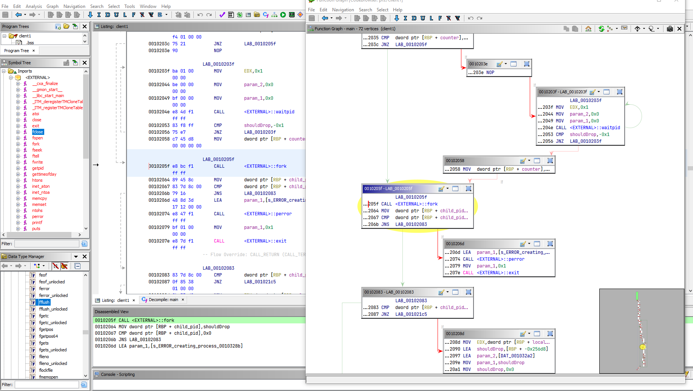
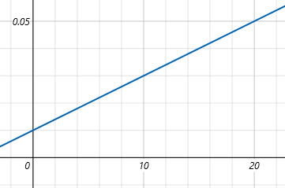

# UDCP

User datagram control protocol unidirectional server implementation.

## Building and running

Cargo and a rust toolchain must be installed. See [rustup](https://rustup.rs/).

### Running the server

```shell
git clone https://github.com/Gui-Yom/prs
cd prs
cargo run
```

### Graphs and data

The server can automatically generate trace graphs.
Compile with the `trace` feature to capture trace data and generate graphs.

```shell
cargo run --features trace
```

### Optimized release build

For a release, build the program with optimizations and remove trace calls at compile time :

```shell
cargo run --release --features tracing/release_max_level_debug
```

## Reverse engineering



### Client drop rate

The following code decides if a packet is dropped or not.

```c
/* Return true if the packet should be dropped */
bool drop_message(double throughputMo, double *threshold, int seq) {
                    /* Recalcul du débit limite tous les 100 paquets */
  if (seq % 100 == 0) {
    *threshold = ((double)(rand() % 100) / 100.0) * 20.0;
  }
                    /* Perte à 1% */
  double dropRate = 0.01;
                    /* si le débit actuel est supérieur au seuil, le drop rate devient 5% */
  if (*threshold <= throughputMo) {
    dropRate = 0.05;
  }
                    /* Tirage de la perte du paquet */
  return (double)(rand() % 100) / 100.0 < dropRate;
}
```

The initial drop rate is 1%. A throughput threshold is randomly chosen every 100 packets. If the current throughput is
greater than this threshold, the drop rates becomes 5%. With a given throughput, the average drop rate fluctuates like
this :



The maximum throughput is somewhere around 20 MB/s, which is the computational limit of the client.

### Client bug

There is a bug in the client. The printf buffer isn't flushed before `fork`ing so it gets copied between child
processes.

https://unix.stackexchange.com/questions/447898/why-does-a-program-with-fork-sometimes-print-its-output-multiple-times

To fix this bug, we inject a dll to hook `fork()` and call `fflush(stdout)` before actually forking.

## Client data processing

`client_postprocessing`
