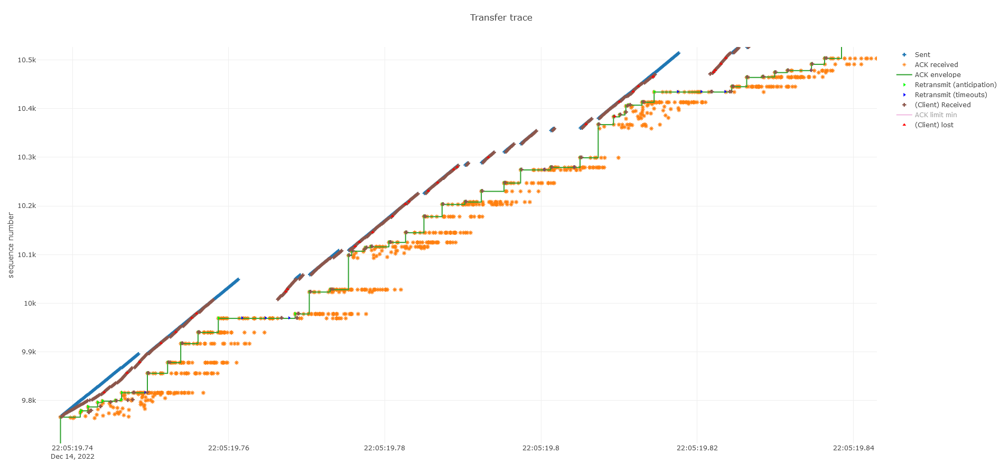
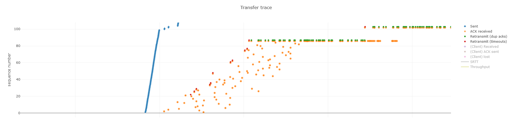
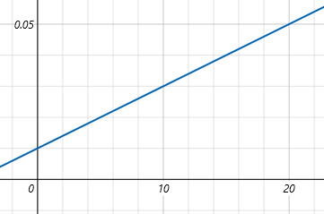
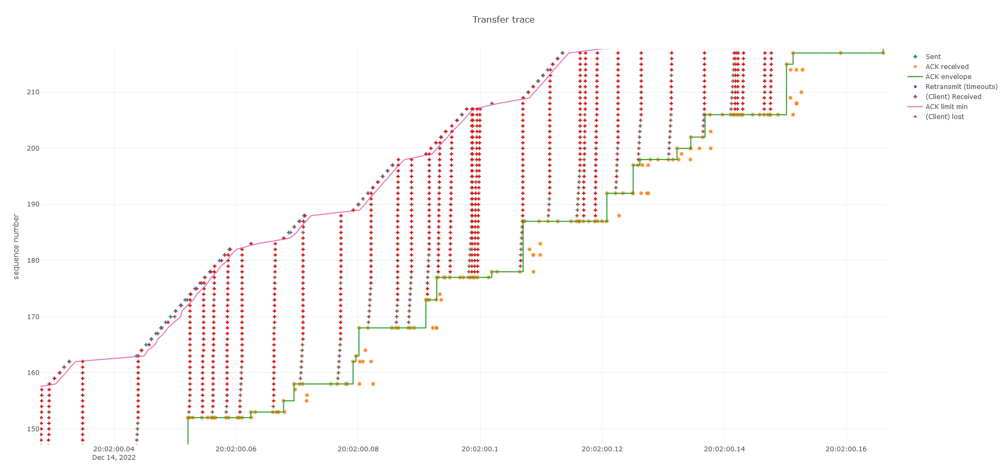

# Projet PRS

G. Anthouard & R. Crignon

Equipe UDCP

<!--
Rémi
-->

---
layout: center
---

# Plan

1. Observabilité
2. Scénarios 1 & 3
3. Scénario 2

<!--
Rémi
-->

---

# Observabilité

Logs, graphes et analyses.



<!--
Guillaume
-->

---

# Observabilité
## Côté serveur

<v-clicks>

- Librairie de logging/tracing
- Traitement des évenement directement dans le serveur (en mémoire)
- Ecriture des résultats à la fermeture
- Création de graphes interactifs (page html)


</v-clicks>

<!--
Guillaume
-->

---

# Observabilité
## Côté client


<div v-click>

*Traitement des logs ? (Redirection du stdout)*

</div>

<div v-click>

Un bug du client empêche tout outillage de fonctionner.

*cf https://unix.stackexchange.com/q/447898*
> When you fork, the child process inherits the unflushed output buffer.

</div>

<!--
Guillaume
-->

---

## Solution

Patcher le client par injection de code. *(Et en profiter pour traiter les logs depuis le client)*

```shell
LD_PRELOAD=libinjection.so ./client1 ...
```

Le client envoie ses traces au serveur à la fin du transfert.

On redéfinit les fonctions `fork()`, `puts()` et `printf()`.

<div v-click>

```c
int offset = 0x2511c;
if (strlen(format) > 36) {
  offset = 0x256bc;
}
register long rbp asm("rbp");
trace_server_ip(ntohl(*(int *)(*(long int *)rbp - offset)));
```

</div>

<!--
Guillaume
-->

---


<!--
Guillaume
-->

---
layout: center
---

# Scénarios 1 & 3

Mêmes clients, même problème.

<!--
Rémi
-->

---
layout: image-right
image: images/ghidra.png
---

# Client 1

<v-clicks>

- Fenêtre de réception de 100 paquets
- Probabilité de perte fonction du débit 
- Délai aléatoire à l'envoi des ACK (1 à 9 ms)

</v-clicks>

<!--
Rémi
-->

---

# Conception

<v-clicks>

- Rendre moins impactante l'attente des ACK
- Retransmettre une perte au plus vite
- Limiter la surcharge du client

</v-clicks>

<!--
Rémi
-->

---

### Étude de la probabilité de réception d'un numéro de sequence

<div v-click>

> J'attend la réception de $M$ ACKs, quelle est la probabilité de réception d'un ack donné ?

Sans tenir compte du délai de l'envoi et du traitement : $\frac{1}{M}$

</div>

<div v-click>

> En sachant que l'ACK $N$ est perdu ?

Les ACK correspondent aux paquets reçus en contigu. Les ACKs de $N$ à $M$ ne seront pas envoyés, ils deviendront des ACKs $N-1$.
Les ACKs de $1$ à $N-2$ auront chacun la probabilité $\frac{1}{M}$. L'ACK $N-1$ aura ainsi une probabilité
de $\frac{M-N+1}{M}$ d'arriver.

</div>

<div v-click>

#### **Conclusion**

Le prochain ACK à arriver est probablement ($\frac{M-N}{M}$) indicateur d'une perte.

</div>

<!--
Guillaume
-->

---

# Implémentation

<v-clicks>

<div>

- Lecture du fichier en 1 fois
> Pas besoin de buffers intermédiaires, gestion de l'état plus simple. Indexage dans le fichier par le numéro de séquence.

<br>
</div><div>

- Fenêtre glissante
> Simple nombre en mémoire, pas de structure de données. Taille max : 80

<br>
</div><div>

- Limiteur d'envoi (Leaky bucket)
> Délai petit (~75µs) donc pas de `sleep()`

<br>
</div><div>

- Retransmission en anticipation
> Lors de la réception d'un nouvel ACK, on retransmet le numéro de séquence suivant

<br>
</div><div>

- Timeout de réponse
> En cas de perte de la retransmission

</div>
</v-clicks>

<!--
Guillaume
-->

---


<!-- Exploration du graphe interactif -->

---

## Cimetière des idées

Dans la plupart des cas, les mécanismes standard de TCP n'ont aucun intérêt dans une situation connue à l'avance.

<v-clicks>

- Slow start
- Fast retransmit
- Redimensionnement de la fenêtre

</v-clicks>

---
layout: center
---

# Scénario 2

---
layout: image-right
image: images/ghidra.png
---

# Client 2

<v-clicks>

- Fenêtre de réception de 100 paquets
- Probabilité de perte fonction du débit (de 5 à 99%)
- Délai aléatoire à l'envoi des ACK (8 à 12 ms)

</v-clicks>

---

# Conception

<v-clicks>

- Limiter la probabilité de perte
- ???

</v-clicks>

---

# Implémentation

<v-clicks>

- Fenêtre glissante
- Retransmission de toute ou une partie de la fenêtre
- Délai d'envoi

</v-clicks>

---



---
layout: center
---

# Questions ?
